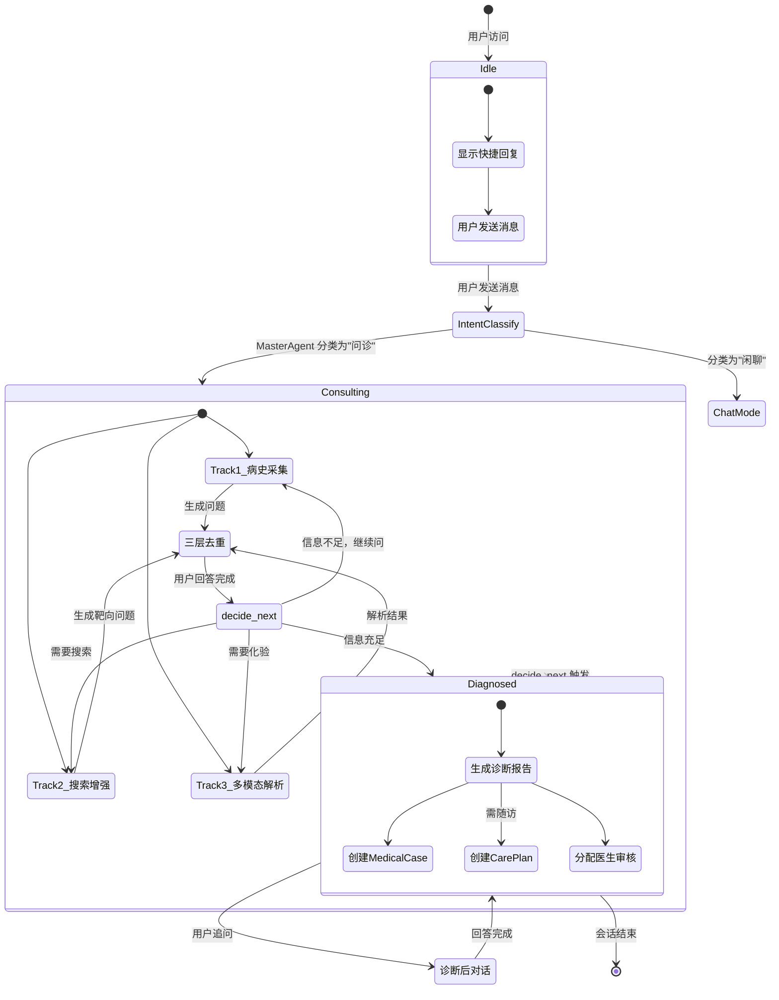

# 🏥 MediCareAI — AI 多 Agent 医疗协作平台

> **多 Agent 自主医疗协作系统 | Multi-Agent Autonomous Medical Collaboration System**
>
> 不是聊天机器人，是一支专业医疗 Agent 团队。
> 患者驱动 + AI 辅助 + 医生验证，为 Agent 时代重新构想。

<p align="center">
  
  
  
  
</p>

---

## 📦 项目信息

| 项目 | 说明 |
|------|------|
| 🔗 GitHub | https://github.com/zhenkunwen/MediCareAI |
| 🎯 定位 | 多 Agent 自主医疗协作平台 |
| 🧠 核心 | 自研 Agent 框架（非 LangChain） |
| 📋 角色 | 访客 / 患者 / 医生 / 管理员 |

---

## 📐 系统架构图

```mermaid
flowchart TB
    subgraph 前端层["前端层 (React 19 + TypeScript)"]
        CP[ChatPage<br/>状态机 idle→consulting→diagnosed]
        PC[PendingCardsPanel<br/>问诊卡片]
        DC[DiagnosisCard<br/>诊断报告]
        LR[LabReportCard<br/>化验单]
    end

    subgraph API层["API 层 (FastAPI)"]
        AG[agents.py<br/>SSE 流式问诊]
        AU[auth.py<br/>JWT 认证]
        PT[patient.py<br/>患者端]
        DR[doctor.py<br/>医生端]
        AD[admin.py<br/>管理后台]
    end

    subgraph Agent层["Agent 层（自研多 Agent 框架）"]
        MA[MasterAgent<br/>意图分类]
        IO[InterviewOrchestrator<br/>三轨问诊编排<br/>decide_next() 决策引擎]
        T1[Track1: 病史采集<br/>LLM 驱动 23 维度]
        T2[Track2: 搜索增强<br/>RAG + 外部搜索]
        T3[Track3: 多模态解析<br/>图片 / 文档→化验单]
        DA[DiagnosisAgent<br/>诊断报告生成]
        PA[PlanningAgent<br/>治疗计划]
    end

    subgraph 基础服务层["基础服务层"]
        LLM[LLMService<br/>统一 AI 调用<br/>多提供商 / Tool Use / 结构化输出]
        TR[ToolRegistry<br/>工具注册表<br/>Function Calling]
        RAG[RAGService<br/>知识库检索]
        SC[SemanticCache<br/>两级语义缓存]
        TB[TokenBudget<br/>Token 预算控制]
        ES[ExternalSearch<br/>SearXNG 外部搜索]
    end

    subgraph 数据层["数据层"]
        DB[(PostgreSQL / SQLite<br/>SQLAlchemy ORM)]
        RD[(Redis<br/>缓存 / 限流)]
        VEC[(pgvector<br/>向量检索)]
    end

    %% 连接
    CP --> AG
    AG --> MA
    MA --> |意图: consultation| IO
    IO --> T1 & T2 & T3
    T1 --> LLM
    T2 --> RAG & ES
    T3 --> LLM
    LLM --> TR
    TR --> DB
    RAG --> VEC
    IO --> |decide_next 完成| DA
    DA --> PA
    DA --> DB
    LLM --> SC & TB
    SC --> RD
    TB --> RD

    classDef frontend fill:#E3F2FD,stroke:#1565C0
    classDef api fill:#FFF3E0,stroke:#E65100
    classDef agent fill:#E8F5E9,stroke:#2E7D32
    classDef service fill:#F3E5F5,stroke:#6A1B9A
    classDef data fill:#FFEBEE,stroke:#C62828
    class CP,PC,DC,LR frontend
    class AG,AU,PT,DR,AD api
    class MA,IO,T1,T2,T3,DA,PA agent
    class LLM,TR,RAG,SC,TB,ES service
    class DB,RD,VEC data
```

---

## 🚀 快速启动

### 方式一：本地开发（SQLite 模式，推荐）

不需要 Docker、不需要 PostgreSQL，一条命令启动：

```bash
# 1. 克隆
git clone https://github.com/zhenkunwen/MediCareAI.git
cd MediCareAI

# 2. 配置环境变量
cp .env.example .env
# 编辑 .env 填入 LLM API Key（如 OPENAI_API_KEY）

# 3. 安装并启动后端
cd backend
pip install -e ".[dev]"
python run_dev.py
# → http://localhost:8000
# → API 文档: http://localhost:8000/docs

# 4. 新终端，启动前端（可选）
cd frontend
npm install
npm run dev
# → http://localhost:3000
```

### 方式二：Docker 生产部署

```bash
docker compose up -d
# → http://localhost:8000
# → API 文档: http://localhost:8000/docs
```

### 默认管理员账号

| 邮箱 | 密码 |
|------|------|
| `admin@medicareai.dev` | `admin123456`（首次登录需改密码） |

### 常见问题

| 问题 | 解决 |
|------|------|
| 端口 8000 被占用 | `netstat -ano \| findstr :8000` → `taskkill //F //PID <PID>` |
| `ModuleNotFoundError` | 运行 `pip install -e ".[dev]"` |
| 无 PostgreSQL/Redis/Celery | SQLite 模式自动降级，不影响核心功能 |
| LLM API Key | 启动后在管理后台 → LLM 配置页填写 |

---

## 🧠 核心模块设计

### 1. 多 Agent 状态机流转



### 2. Agent 层架构

| 组件 | 文件 | 职责 |
|------|------|------|
| **MasterAgent** | `services/agents.py` | 意图分类。判断用户是想问诊、查知识还是闲聊 |
| **InterviewOrchestrator** | `services/orchestrator.py` | **核心决策引擎**。管理 InterviewState（23 个临床维度），通过 `decide_next()` 决定下一步动作 |
| **Track1：病史采集** | `services/orchestrator.py` | LLM 驱动的动态问诊，根据已收集信息生成下一个问题 |
| **Track2：搜索增强** | `services/orchestrator.py` | RAG 检索 + SearXNG 外部搜索 → 生成靶向问题 |
| **Track3：多模态解析** | `services/multimodal_parser.py` | 图片/文档 → 化验单结构化解析 |
| **DiagnosisAgent** | `services/agents.py` | 综合所有信息，生成结构化诊断报告 |
| **PlanningAgent** | `services/agents.py` | 生成治疗计划与随访方案 |
| **MonitoringAgent** | `services/agents.py` | 病情监测与异常告警 |

### 3. 三轨并行问诊流程

```
用户发主诉
  │
  ▼
MasterAgent 意图分类
  │ 意图 = consultation
  ▼
interview() 创建 InterviewState（23 维度）
  │
  ├── 三轨并行 ──────────────────────────────┐
  │  Track1: LLM 动态问诊                     │
  │     → 每个问题标记 phase_key              │
  │     → 相位守卫（completed 不可降级）      │
  │                                           │
  │  Track2: RAG + 外部搜索                   │
  │     → 嵌入查询 → pgvector 相似度检索      │
  │     → SearXNG 搜索 → 生成问题             │
  │                                           │
  │  Track3: 多模态解析                       │
  │     → 图片 → LLM Vision → LabReport       │
  │     → 化验单 bridge 归一化                │
  └───────────────────────────────────────────┘
  │
  ├── 三层去重
  │  第1层：同轮互斥（不问矛盾问题）          │
  │  第2层：phase_key 前缀（同一维度不重复）  │
  │  第3层：LLM 语义去重（意思相同丢弃）       │
  │
  ▼
decide_next() 决策引擎
  ├── 还有维度没问？→ Track1
  ├── 需要搜资料？→ Track2
  ├── 需要化验？→ Track3
  └── 全部完成？→ 调 DiagnosisAgent
  │
  ▼
DiagnosisAgent → 结构化诊断报告
  ├── 主要诊断 + 置信度
  ├── 鉴别诊断
  ├── 严重程度（轻/中/重）
  └── 建议（检查/用药/随访）
  │
  ▼
后处理（自动创建）
  ├── MedicalCase（病例）
  ├── PendingConsultation（待会诊，分配给医生）
  └── CarePlan（随访计划 + 任务）
```

### 4. 基础服务层

#### LLMService — 统一 AI 调用

```python
class LLMService:
    """
    封装所有 AI 调用，支持：
    - 多提供商（OpenAI / DeepSeek / GLM / Qwen 等）
    - Tool Call / Function Calling
    - 结构化输出（JSON Schema）
    - 流式输出（SSE）
    - 多模态（图片理解）
    """
    async def chat(...)               # 普通对话
    async def chat_stream(...)        # 流式对话
    async def chat_with_tools(...)    # 工具调用对话
    async def generate_structured(...) # 结构化输出
    async def chat_vision(...)        # 多模态对话
```

**请求流**：
```
LLMService.chat()
  → TokenBudget.check()         # 24h 滑动窗口限流
  → SemanticCache.get()         # Level1: MD5 精确 / Level2: 余弦 >0.95
  → LLM API 调用
  → TokenBudget.deduct()        # 扣除 token
  → SemanticCache.set()         # 写入缓存（fire-and-forget）
```

#### ToolRegistry — 工具注册表

```python
class ToolRegistry:
    """
    所有工具的注册与调度中心。
    工具定义 → 自动生成 OpenAI Function Calling Schema → LLM 选择调用 → 执行并返回
    """
    def register(self, tool: Tool)    # 注册工具
    def list_schemas(self) -> list    # 生成 OpenAI 格式 schema
    async def execute(self, name, **kwargs)  # 执行工具
```

已注册工具：`query_patient_history`、`search_medical_knowledge` 等。

#### SemanticCache — 语义缓存

```python
"""
两级缓存，拦截点在 LLMService.chat():
Level 1（精确匹配）：md5(messages + system_prompt + model + provider) → Redis
Level 2（语义匹配）：embedding 余弦相似度 > 0.95 命中
Redis 不可用时静默降级
"""
```

---

## 🛠 技术栈

| 层级 | 技术 |
|------|------|
| **后端** | Python 3.12 + FastAPI 0.115 + SQLAlchemy 2.0 (async) |
| **前端** | React 19 + TypeScript + Vite + MUI 9 |
| **数据库** | PostgreSQL 17 + pgvector（生产）/ SQLite（开发） |
| **缓存** | Redis |
| **任务队列** | Celery |
| **AI/LLM** | OpenAI 兼容多提供商（OpenAI / DeepSeek / GLM / Qwen 等） |
| **认证** | JWT + 角色制（访客 / 患者 / 医生 / 管理员） |
| **搜索** | SearXNG（外部搜索）+ pgvector（向量检索）|
| **部署** | Docker Compose → VPS |
| **测试** | pytest + httpx |

---

## 📁 项目结构

```
MediCareAI/
├── backend/
│   ├── app/
│   │   ├── api/v1/          # REST + SSE 端点
│   │   │   ├── agents.py    # 核心：SSE 流式问诊
│   │   │   ├── auth.py      # JWT 登录/注册
│   │   │   ├── patient.py   # 患者端
│   │   │   ├── doctor.py    # 医生端
│   │   │   └── admin.py     # 管理后台
│   │   ├── services/        # ❤️ 核心业务逻辑
│   │   │   ├── agents.py    # MasterAgent, DiagnosisAgent...
│   │   │   ├── orchestrator.py  # decide_next() 决策引擎
│   │   │   ├── llm.py       # 统一 LLM 服务
│   │   │   ├── rag.py       # RAG 检索服务
│   │   │   └── semantic_cache.py  # 语义缓存
│   │   ├── models/          # SQLAlchemy 模型
│   │   ├── tools/           # 工具注册表（Function Calling）
│   │   ├── db/              # 数据库会话 + 迁移
│   │   └── tasks/           # Celery 后台任务
│   └── tests/
├── frontend/
│   ├── src/
│   │   ├── components/      # ChatPage, DiagnosisCard 等
│   │   ├── api/             # API 客户端 + SSE
│   │   └── theme/           # 设计 token
│   └── package.json
├── docs/                    # 详细文档
├── docker-compose.yml
└── README.md               # ← 你现在在看这个
```

---

## 📋 当前状态

| 功能 | 状态 |
|------|:----:|
| ✅ 三轨问诊（Track1 病史采集 + Track2 搜索增强 + Track3 多模态） | 完成 |
| ✅ 自定义 Agent 框架（非 LangChain） | 完成 |
| ✅ 多提供商 LLM 支持（OpenAI / DeepSeek / GLM / Qwen） | 完成 |
| ✅ ToolRegistry + Function Calling | 完成 |
| ✅ 语义缓存（两级缓存） | 完成 |
| ✅ Token Budget 限流 | 完成 |
| ✅ RAG 检索 + 外部搜索 | 完成 |
| ✅ 诊断后对话 | 完成 |
| ✅ MedicalCase / CarePlan 自动创建 | 完成 |
| ✅ 患者端健康档案 + 随访计划 | 完成 |
| 🔄 医生端控制台 | 开发中 |
| 📋 MCP 协议支持 | 计划中 |
| 📋 GraphRAG | 计划中 |
| 📋 Android App | 计划中 |

---

## 💡 设计亮点

### 为什么不用 LangChain？

项目最初评估了 LangChain，结论是"过度复杂"。自研框架的优势：

| 对比 | LangChain | 本项目 |
|------|-----------|--------|
| 依赖 | 重量级，全量引入 | 零额外依赖 |
| 灵活性 | 受限于抽象层 | 完全可控 |
| 调试 | 黑盒链路 | 每步可打日志追踪 |
| Token 控制 | 无内置 | 滑动窗口预算控制 |
| 缓存 | 无内置 | 两级语义缓存 |
| 结构化输出 | 需额外配置 | Pydantic Schema 原生支持 |

---

## 📝 License

[MIT](LICENSE) © 2026 zhenkunwen
